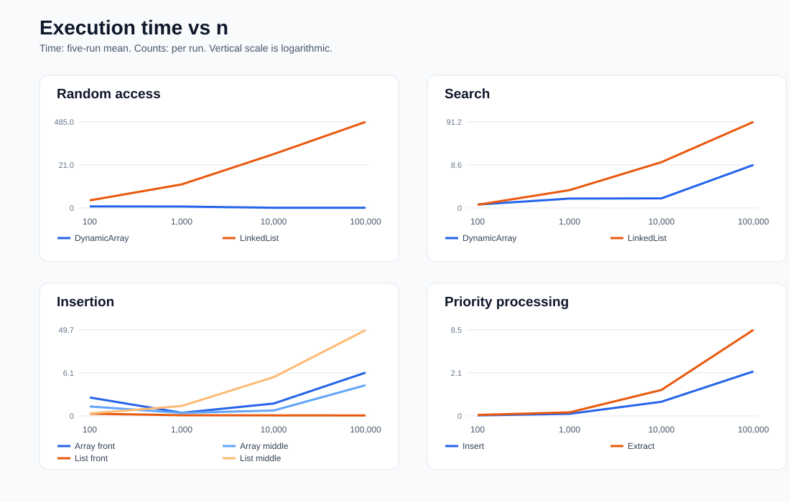
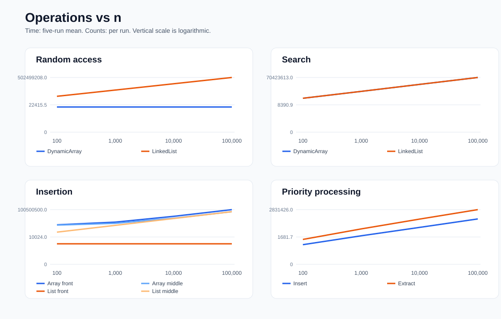

# Assignment 2: Data Structures and Performance

## Overview

I implemented a dynamic array, a singly linked list, and a min-heap in Java. The goal is to see how their layout affects common operations, not just to compare Big-O labels.

From the project folder:

```text
javac -d . src/*.java
java Tests
java Benchmark
python results/plots.py
```

The benchmark recreates four CSV files in `results`. The last command recreates the two SVG plots with Python 3.

## Complexity analysis

Here `n` is the current number of elements. The average column assumes an ordinary mix of valid indices or search positions. Heap insertion depends on input values, so its average column gives an upper bound. Space is extra space for one operation.

| Structure | Operation | Best | Average | Worst | Extra space |
|---|---|---|---|---|---|
| Dynamic array | `add(x)` | Θ(1) | Θ(1) amortized | O(n) | O(n) on resize |
| Dynamic array | `add(index,x)` | Θ(1) | Θ(n) | O(n) | O(n) on resize |
| Dynamic array | `remove(index)` | Θ(1) | Θ(n) | O(n) | Θ(1) |
| Dynamic array | `get(index)` | Θ(1) | Θ(1) | Θ(1) | Θ(1) |
| Dynamic array | `contains(x)` | Θ(1) | Θ(n) | O(n) | Θ(1) |
| Linked list | `add(x)` | Θ(1) | Θ(1) | Θ(1) | Θ(1) |
| Linked list | `add(index,x)` | Θ(1) | Θ(n) | O(n) | Θ(1) |
| Linked list | `remove(index)` | Θ(1) | Θ(n) | O(n) | Θ(1) |
| Linked list | `get(index)` | Θ(1) | Θ(n) | O(n) | Θ(1) |
| Linked list | `contains(x)` | Θ(1) | Θ(n) | O(n) | Θ(1) |
| Min-heap | `insert(x)` | Θ(1) | O(log n) amortized | O(n) on resize | O(n) on resize |
| Min-heap | `peekMin()` | Θ(1) | Θ(1) | Θ(1) | Θ(1) |
| Min-heap | `extractMin()` | Θ(1) | O(log n) | O(log n) | Θ(1) |

The dynamic array reads an index directly. Insertion and removal shift later elements. Appending is usually constant time, but doubling capacity copies all elements occasionally; that is why one append can take O(n) while a long sequence is Θ(1) amortized per append. The list can change its head or append through its tail in constant time, but reaching an index takes a walk from the head. Search can stop at the first element, or inspect all `n` elements. An unsuccessful search takes both Ω(n) and O(n) comparisons, so its time is Θ(n). Heap insertion moves up a tree of height O(log n), apart from an occasional array resize. Extraction moves down at most that height. `peekMin()` reads the root.

## Correctness

### Dynamic array removal

Suppose the old size is `s` and index `k` is removed. The loop copies `data[i + 1]` to `data[i]` for `i = k` through `s - 2`.

Invariant: before iteration `i`, positions before `k` are unchanged, and each position `j` from `k` to `i - 1` contains the old value from `j + 1`. Initially `i = k`, so the shifted range is empty and the invariant holds. During an iteration, the source at `i + 1` still has its old value because the loop moves left to right. Copying it to `i` extends the correct range by one. When the loop ends, positions `k` through `s - 2` contain their old successors. Decreasing the size hides the old final slot. The returned value was saved before shifting, so the result is exactly the old sequence without item `k`.

### Min-heap insertion

The new item starts at the next leaf position. The loop moves it upward while its parent is larger.

Invariant: before each iteration, the old heap values still satisfy heap order except possibly on the edge between the current position and its parent. The inserted value is held in `value`, and its open position lies on the path from the new leaf to the root. Initially only the new leaf edge can violate order, since all old edges were valid. If the parent is larger than `value`, moving that parent down fills the open position. That parent was no larger than the old values below it, so the lower edges remain valid. The possible violation moves one level upward. At termination, the position is either the root or its parent is no larger than `value`. Writing `value` there fixes the final edge. All values are present and every parent is no greater than its children.

## Experimental setup

All applicable workloads use initial sizes `n = 100, 1,000, 10,000, 100,000`. Each case runs five times. Inputs use fixed seeds 42 and 43 and are generated before timing. Structures are filled before timing except in the heap workload, where insertion is the measured operation. Timing uses `System.nanoTime()`; setup, input generation, printing, and verification are outside the timed sections.

Random access performs `m = 10,000` gets at preselected random indices. Search performs `m = 1,000` contains calls: 500 values from the input and 500 absent values (`-1`). Insertion and removal each perform `m = 1,000` operations at index 0 or fixed index `n / 2`. Heap processing inserts `n` values, then extracts `n` values and checks their sorted order.

The access metric counts one array access or `index + 1` visited list nodes. Search counts value comparisons until the first match. For changes, the array metric counts shifted or copied elements plus the inserted write or removed read. The list metric counts nodes reached plus the node directly changed, so a front change has one access. The heap metric counts value comparisons. These counts are computed from the exact operations, except heap comparisons, which are counted inside the heap.

For small `n`, 1,000 removals cannot all come from one original structure. When the next fixed index is no longer valid, the original `n` elements are restored outside the timer. This happens for front removal at `n = 100` and middle removal at `n = 100` and `n = 1,000`. The timed removal count still totals 1,000 per run. Short operations are timed individually in this workload, so clock overhead can affect very small times.

## Results

Each time is the mean total milliseconds for a workload. Each count is the total per run. The two plots show access, search, insertion, and heap processing. Removal results are in the tables.





### Random access

| Operation | Structure | n | Mean ms | Accesses | Theory |
|---|---|---:|---:|---:|---|
| get | DynamicArray | 100 | 0.1208 | 10000 | O(m) |
| get | LinkedList | 100 | 0.7254 | 511508 | O(mn) |
| get | DynamicArray | 1000 | 0.1062 | 10000 | O(m) |
| get | LinkedList | 1000 | 4.4646 | 5015208 | O(mn) |
| get | DynamicArray | 10000 | 0.0132 | 10000 | O(m) |
| get | LinkedList | 10000 | 46.9430 | 50139208 | O(mn) |
| get | DynamicArray | 100000 | 0.0135 | 10000 | O(m) |
| get | LinkedList | 100000 | 484.9847 | 502499208 | O(mn) |

### Search

| Operation | Structure | n | Mean ms | Comparisons | Theory |
|---|---|---:|---:|---:|---|
| contains | DynamicArray | 100 | 0.1987 | 73167 | O(mn) |
| contains | LinkedList | 100 | 0.1847 | 73167 | O(mn) |
| contains | DynamicArray | 1000 | 0.6378 | 715219 | O(mn) |
| contains | LinkedList | 1000 | 1.5599 | 715219 | O(mn) |
| contains | DynamicArray | 10000 | 0.6544 | 7087866 | O(mn) |
| contains | LinkedList | 10000 | 10.1335 | 7087866 | O(mn) |
| contains | DynamicArray | 100000 | 8.5880 | 70423613 | O(mn) |
| contains | LinkedList | 100000 | 91.1669 | 70423613 | O(mn) |

### Insertion and removal

| Operation | Structure | n | Mean ms | Movements / accesses | Theory |
|---|---|---:|---:|---:|---|
| insert_front | DynamicArray | 100 | 1.3196 | 601620 | O(m(n+m)) |
| remove_front | DynamicArray | 100 | 0.1815 | 50500 | O(mn) |
| insert_middle | DynamicArray | 100 | 0.5408 | 551620 | O(m(n+m)) |
| remove_middle | DynamicArray | 100 | 0.1170 | 25500 | O(mn) |
| insert_front | LinkedList | 100 | 0.1054 | 1000 | O(m) |
| remove_front | LinkedList | 100 | 0.0690 | 1000 | O(m) |
| insert_middle | LinkedList | 100 | 0.1187 | 51000 | O(mn) |
| remove_middle | LinkedList | 100 | 0.1215 | 51000 | O(mn) |
| insert_front | DynamicArray | 1000 | 0.1534 | 1501780 | O(m(n+m)) |
| remove_front | DynamicArray | 1000 | 0.0995 | 500500 | O(mn) |
| insert_middle | DynamicArray | 1000 | 0.1455 | 1001780 | O(m(n+m)) |
| remove_middle | DynamicArray | 1000 | 0.0582 | 250500 | O(mn) |
| insert_front | LinkedList | 1000 | 0.0322 | 1000 | O(m) |
| remove_front | LinkedList | 1000 | 0.0272 | 1000 | O(m) |
| insert_middle | LinkedList | 1000 | 0.5778 | 501000 | O(mn) |
| remove_middle | LinkedList | 1000 | 0.5455 | 501000 | O(mn) |
| insert_front | DynamicArray | 10000 | 0.7635 | 10510740 | O(m(n+m)) |
| remove_front | DynamicArray | 10000 | 0.7177 | 9500500 | O(mn) |
| insert_middle | DynamicArray | 10000 | 0.2836 | 5510740 | O(m(n+m)) |
| remove_middle | DynamicArray | 10000 | 0.2451 | 4500500 | O(mn) |
| insert_front | LinkedList | 10000 | 0.0265 | 1000 | O(m) |
| remove_front | LinkedList | 10000 | 0.0249 | 1000 | O(m) |
| insert_middle | LinkedList | 10000 | 4.8761 | 5001000 | O(mn) |
| remove_middle | LinkedList | 10000 | 5.0014 | 5001000 | O(mn) |
| insert_front | DynamicArray | 100000 | 6.2103 | 100500500 | O(m(n+m)) |
| remove_front | DynamicArray | 100000 | 6.0999 | 99500500 | O(mn) |
| insert_middle | DynamicArray | 100000 | 3.0767 | 50500500 | O(m(n+m)) |
| remove_middle | DynamicArray | 100000 | 3.0893 | 49500500 | O(mn) |
| insert_front | LinkedList | 100000 | 0.0218 | 1000 | O(m) |
| remove_front | LinkedList | 100000 | 0.0208 | 1000 | O(m) |
| insert_middle | LinkedList | 100000 | 49.2077 | 50001000 | O(mn) |
| remove_middle | LinkedList | 100000 | 49.7419 | 50001000 | O(mn) |

### Priority processing

| Operation | n | Mean ms | Comparisons | Theory |
|---|---:|---:|---:|---|
| insert | 100 | 0.0145 | 206 | O(n log n) |
| extract | 100 | 0.0260 | 863 | O(n log n) |
| insert | 1000 | 0.0574 | 2326 | O(n log n) |
| extract | 1000 | 0.0992 | 14996 | O(n log n) |
| insert | 10000 | 0.4492 | 22753 | O(n log n) |
| extract | 10000 | 0.9765 | 216531 | O(n log n) |
| insert | 100000 | 2.2118 | 227857 | O(n log n) |
| extract | 100000 | 8.5263 | 2831426 | O(n log n) |

## Discussion

The array takes nearly constant time for 10,000 indexed reads as `n` grows, while the list has to visit more nodes. Both searches make the same number of value comparisons, but the list is generally slower because its nodes are separate in memory. Front list insertion and removal need no traversal; the array shifts many elements. Middle list changes still require a walk. Heap extraction makes more comparisons than insertion because it chooses between children on its way down.

The main trends agree with the complexity analysis. Small timings do not always rise smoothly: JVM warm-up, allocation, cache effects, and the cost of calling the clock matter when an operation is very short. Two methods with the same O(n) bound can still have different times because moving consecutive array elements is different from following list nodes. These constants do not change the growth bound, but they matter at the tested sizes.

## Design recommendations

Use the dynamic array for frequent indexing and usually for scanning. Use the linked list when most changes are at the front or when appending through its tail; it does not make middle access cheap. Use the min-heap when the next smallest item must be processed repeatedly. The best choice depends on the mix of operations, not just the size of the data.

## Conclusion

The measurements show why storage layout matters. Arrays give cheap indexing, links give cheap head changes, and heaps give efficient minimum processing. The tests compare the array with `ArrayList` and the heap with `PriorityQueue`, including empty, single-element, duplicate, boundary, invalid-index, and large-input cases.


